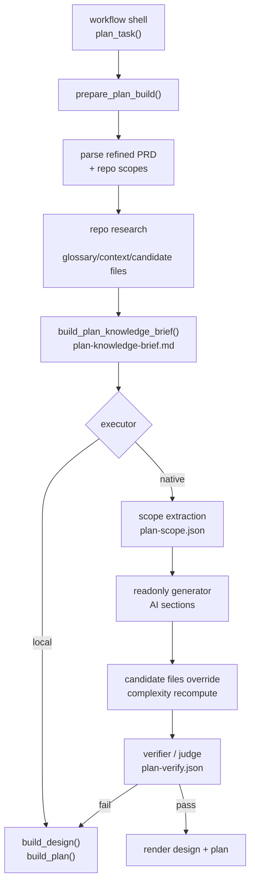

# Plan Engine

本文解释 `coco-flow` 当前 `plan` 引擎做了什么、为什么要这样编排，以及这样设计对后续 `code` 阶段有什么价值。

如果本文与代码不一致，以代码为准。

关于面向研发的 `design` / `plan` 产物目标章节结构，另见
[`docs/plan-output-structure.md`](docs/plan-output-structure.md)。

关于执行型 `plan.md` 的目标结构，另见
[`docs/plan-task-structure.md`](docs/plan-task-structure.md)。

关于当前引擎和目标结构之间的差距，另见
[`docs/plan-engine-gap.md`](docs/plan-engine-gap.md)。

关于字段级 schema 契约，另见
[`docs/plan-schema-spec.md`](docs/plan-schema-spec.md)。

关于第一批代码实施切分，另见
[`docs/plan-implementation-slices.md`](docs/plan-implementation-slices.md)。

## 先给结论

`plan` 的目标不是“写一份看起来完整的方案文档”，而是把 `prd-refined.md` 转成两类可执行产物：

- `design.md`：解释边界、上下文、风险和方案摘要
- `plan.md`：给后续执行阶段提供候选文件、任务拆分、实施步骤和验证建议

它当前重点解决的是四个问题：

- refined PRD 仍然偏产品表达，离代码落点还有距离
- 需求可能绑定多个 repo，需要先判断主责任仓库和改动边界
- 纯靠模型容易把候选文件、复杂度和风险说飘
- `code` 阶段需要稳定输入，不能直接消费一段自由发挥的方案文本

所以当前 `plan` 被拆成：

- `prepare build`
- `repo research`
- `knowledge brief`
- `scope extraction`
- `generator`
- `verify`
- `render`

核心原则是：先做本地调研和边界收敛，再让 AI 参与生成，最后由统一 renderer 产出正式文档。

## 代码位置

- workflow 壳：[src/coco_flow/services/tasks/plan.py](/Users/bytedance/Work/tools/bytedance/coco-flow/src/coco_flow/services/tasks/plan.py)
- 主编排：[src/coco_flow/engines/plan.py](/Users/bytedance/Work/tools/bytedance/coco-flow/src/coco_flow/engines/plan.py)
- prompt / 解析 / verifier：[src/coco_flow/engines/plan_generate.py](/Users/bytedance/Work/tools/bytedance/coco-flow/src/coco_flow/engines/plan_generate.py)
- 本地调研：[src/coco_flow/engines/plan_research.py](/Users/bytedance/Work/tools/bytedance/coco-flow/src/coco_flow/engines/plan_research.py)
- knowledge brief：[src/coco_flow/engines/plan_knowledge.py](/Users/bytedance/Work/tools/bytedance/coco-flow/src/coco_flow/engines/plan_knowledge.py)
- 文档渲染：[src/coco_flow/engines/plan_render.py](/Users/bytedance/Work/tools/bytedance/coco-flow/src/coco_flow/engines/plan_render.py)

## 分层职责

### workflow 壳

`services/tasks/plan.py` 负责：

- 校验 task 状态是否允许执行 `plan`
- 维护 `plan.log`
- 调用 `run_plan_engine(...)`
- 写入 `design.md`、`plan.md` 和中间 artifact
- 更新 task / repo 状态

这么做的好处是：`plan` 的任务状态流转和方案推理分开，后续不管内部 prompt 怎么演进，task lifecycle 都不受影响。

### engine

`engines/plan.py` 负责主编排：

- 组装统一的 `PlanBuild`
- 执行 repo research
- 聚合多 repo context 和候选文件
- 生成 knowledge brief
- 在 native 模式下执行 `scope -> generator -> verify`
- 在 local 模式下直接走本地 renderer

### renderer

`plan_render.py` 负责把 `PlanBuild` 和 AI 补充内容渲染成最终文档。

这层独立出来很重要，因为它让 `native` 和 `local` 最终都落到同一套文档骨架上，而不是让 AI 直接控制整份 `plan.md` 的最终结构。

## 为什么不是“PRD refined -> 大 prompt -> plan.md”

如果直接把 refined PRD 扔给模型生成方案，常见问题是：

- 说得头头是道，但和 repo 实际文件结构不一致
- 多 repo 任务里搞不清责任边界
- 风险和复杂度判断不稳定
- 产物格式看起来像方案，实际上不适合继续自动执行

当前方案先做本地 research，再让 AI 参与局部决策，原因是：

- repo 事实应该优先于模型猜测
- 改动边界需要代码侧锚点，不应只靠 PRD 文本
- 最终文档结构应该由系统掌控，而不是完全交给模型

## 当前编排

## 每一步为什么存在

### 1. `prepare build`: 先把所有输入压成一个统一工作面

实现位置：[plan.py](/Users/bytedance/Work/tools/bytedance/coco-flow/src/coco_flow/engines/plan.py) 的 `prepare_plan_build`

这里会统一读取：

- `prd.source.md`
- `prd-refined.md`
- `repos.json`
- repo research 结果
- knowledge brief
- complexity assessment

这么做的原因：

- `plan` 消费的信息比 `refine` 多得多
- native 和 local 共享同一份基础事实，才能保证回退一致

收益：

- AI 失败时能无损切回 local
- `design.md`、`plan.md`、`plan.log` 和中间 artifacts 围绕同一个 `PlanBuild` 生成，不容易互相打架

### 2. `repo research`: 先做代码侧收敛，再谈方案

实现位置：[plan_research.py](/Users/bytedance/Work/tools/bytedance/coco-flow/src/coco_flow/engines/plan_research.py)

当前 research 主要做三件事：

- 读取 `.livecoding/context/` 中的 glossary、architecture、patterns、gotchas
- 从 refined PRD 里提炼术语并做 glossary 命中
- 基于术语和启发式搜索 candidate files / candidate dirs

这么做的原因：

- `plan` 的核心不是重写需求，而是确定代码落点和改动边界
- 不先看 repo，模型很容易给出抽象但不可执行的计划

收益：

- 候选文件和目录有代码事实支撑
- complexity 可以建立在“需求 + 代码落点”上，而不是只看 PRD 长短
- 多 repo 场景下可以分 repo 调研，再统一聚合

### 3. `knowledge brief`: plan 阶段吃的是“决策信息”，不是“知识全文”

实现位置：[plan_knowledge.py](/Users/bytedance/Work/tools/bytedance/coco-flow/src/coco_flow/engines/plan_knowledge.py)

`plan` 和 `refine` 对知识的需求不一样。`plan` 更关心：

- 改动边界
- 稳定规则
- 主链路约束
- 风险点
- 验证重点

所以这里会把命中的 approved knowledge 压成：

- 决策边界
- 稳定规则
- 验证要点

这么做的原因：

- `plan` 阶段不需要知识全文
- 需要的是能指导“怎么改、改到哪、怎么验”的高信号信息

收益：

- prompt 更短、更聚焦
- `design.md` / `plan.md` 都能复用同一份 brief
- 即使不用 AI，local renderer 也能把这些决策材料展示出来

### 4. `scope extraction`: 先让模型收边界，再让它写方案

实现位置：[plan_generate.py](/Users/bytedance/Work/tools/bytedance/coco-flow/src/coco_flow/engines/plan_generate.py) 的 `build_plan_scope_prompt`

这里先让模型只做一件事：把当前任务压成一个小的 scope JSON，包括：

- `summary`
- `boundaries`
- `priorities`
- `risk_focus`
- `validation_focus`

这么做的原因：

- 直接生成完整方案时，模型容易边界发散
- `scope` 是后续 generator 和 verifier 的共同基线

收益：

- 先把“改什么、不改什么、先看什么、重点验什么”说清楚
- 把 plan 从“一次性写作任务”变成“先定边界、再写正文”的两阶段过程

### 5. `generator`: 用 readonly agent 补充实现摘要，而不是全权接管文档

native 模式下，`generator` 会输出结构化片段：

- `IMPLEMENTATION SUMMARY`
- `CANDIDATE FILES`
- `IMPLEMENTATION STEPS`
- `RISK NOTES`
- `VALIDATION EXTRA`

这么做的原因：

- 我们需要 AI 的综合表达能力，但不希望它决定最终文档格式
- AI 更适合补充摘要、步骤和风险，不适合直接决定完整 plan 文档结构

收益：

- AI 的价值集中在它擅长的部分
- 最终结构仍由 renderer 控制，输出更稳定

### 6. `candidate files override + complexity recompute`: 允许 AI 修正，但必须回到系统模型里

如果 generator 给出的候选文件合理，系统会用 AI 的结果覆盖本地 baseline，并重新计算复杂度。

这么做的原因：

- 本地 research 是启发式的，不一定总是最准
- 但 AI 的修正也必须被系统接住，而不是停留在一段自由文本里

收益：

- 兼顾规则调研和模型判断
- 复杂度、任务拆分、验证建议都能同步基于更新后的文件集合重算

### 7. `verify`: 给 plan 再加一道可信度闸门

verifier 会检查：

- `summary / steps / risks` 是否完整
- AI 候选文件是否与本地 baseline 明显冲突
- 复杂度高时是否保留了足够风险提示

这么做的原因：

- 方案生成比 refine 更容易“说得像对，其实不落地”
- 特别是候选文件和复杂度判断，不能只信一次生成

收益：

- 把明显失真的 AI 结果拦在 renderer 之前
- verifier 不通过时直接回退 local，保证主链路稳定

### 8. `render`: 正式文档由系统生成，不由模型直接吐最终版

实现位置：[plan_render.py](/Users/bytedance/Work/tools/bytedance/coco-flow/src/coco_flow/engines/plan_render.py)

这里会基于统一的 `PlanBuild` 渲染：

- `design.md`
- `plan.md`

这么做的原因：

- 文档结构、字段和语义需要稳定，后续 `code` 阶段才好消费
- local / native 都需要尽量对齐同一种外部行为

收益：

- 方案文档更像“系统产物”，而不是“模型作文”
- 多 repo 任务拆分、依赖关系和候选文件组织都可控

## 多 repo 为什么要按 repo 分别 research 再聚合

当前 `plan` 不直接把多个 repo 混成一个整体搜索，而是：

- 先对每个 repo 分别读取 context
- 分别做 glossary 命中和候选文件搜索
- 最后再聚合成 task 级 findings

这么做的原因：

- 多 repo 的同名术语和目录很容易串
- 责任边界本来就是 repo 级问题

收益：

- `design.md` 和 `plan.md` 更容易说明“哪个 repo 先动、哪个 repo 后动”
- 候选文件前缀和任务拆分更清晰
- 给 `code-all` 这种 repo 级推进方式保留基础数据

## 为什么同时保留 `native` 和 `local`

和 `refine` 一样，`plan` 也不能把成功率完全压在 AI 上。

当前策略是：

- `native`：尽量拿到更强的 scope、步骤和风险表达
- `local`：确保最差情况下仍能产出可读、可继续推进的 `design.md` / `plan.md`

这背后的好处是：

- 方案质量有上限
- workflow 稳定性有下限保障

两者不是互斥关系，而是质量层和可靠性层的组合。

## 产物为什么这样设计

当前 `plan` 主要产出：

- `design.md`
- `plan.md`
- `plan-knowledge-selection.json`
- `plan-knowledge-brief.md`
- `plan-scope.json`
- `plan-verify.json`
- `plan.log`

这些产物分别解决不同问题：

- 给人看上下文和设计判断：`design.md`
- 给系统和执行阶段看任务拆分和验证建议：`plan.md`
- 给排障和调优看过程：中间 json / md / log

这样做的收益是：你不仅知道 plan 结果是什么，还知道它为什么判成这样、卡在哪一步、有没有走回退。

## 对 `code` 阶段的直接价值

当前 `plan` 的设计直接服务 `code`：

- `plan.md` 会给出候选文件和任务列表，缩小执行范围
- complexity 高时会明确提示“不建议直接自动 code”
- 多 repo 任务会保留 repo 级边界，便于按 repo 推进

也就是说，`plan` 不是文档装饰层，而是 `code` 的风险前置层和范围压缩层。

## 当前收益

这套设计当前带来的主要收益是：

- 先基于 repo 事实收边界，再用 AI 补强表达
- 多 repo 任务不会被粗暴压平成单 repo 视角
- native 结果不可信时可以显式回退
- 最终产物结构稳定，适合继续自动执行

## 当前边界

当前 `plan` 也有边界：

- research 仍以启发式搜索为主，不是完整静态分析
- verifier 目前是一次守门，还不是多轮 repair loop
- 复杂度评估是工程上的近似判断，不是严格容量评估
- 它能显著帮助收敛范围，但不能替代人工做架构级取舍

如果继续演进，比较自然的方向是：

- 提升 candidate files 的召回和排序
- 做更细的 repo 间依赖推断
- verifier 失败后尝试局部修复而不是直接整体回退
- 让 `design.md` / `plan.md` 和 repo 级 code artifact 建立更强的可追踪关系
