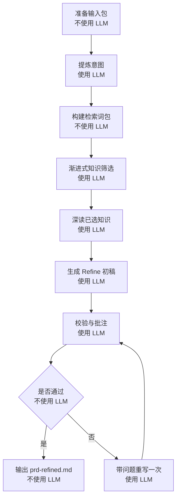

# Refine V2 Design

本文用于定义 `coco-flow` 下一版 `Refine` 阶段的正式设计。

结论优先：

- 本文面向当前 6 阶段工作流，不继续沿用旧 `docs/refine-engine.md` / `docs/refine-output-structure.md` 的结论。
- 本版 `Refine` 不再依赖 repo context。
- 本版 `Refine` 的核心输入来自 `Input` 产物与知识库文档。
- 本版 `Refine` 的核心目标不是“润色 PRD”，而是输出一份对人更友好、同时能继续推进后续阶段的精炼需求稿。

## 目标

`Refine` 要解决的不是信息不够多，而是信息不够聚焦。

输入通常包含：

- 原始 PRD 正文
- 飞书文档落盘后的正文
- 研发补充说明
- 零散但相关的知识文档

真正需要产出的，是一份帮助用户快速判断“要做什么、风险是什么、还有什么没对齐”的文档。

本版 `Refine` 的目标收敛为 4 件事：

1. 提炼核心诉求，不被长文档和背景噪音带偏。
2. 显式抛出风险。
3. 显式记录讨论点和待补充信息。
4. 划清边界与非目标。

## 输入契约

本版 `Refine` 的输入，不再以“repo + source”理解，而是以 `Input Bundle` 理解。

### 输入来源

`Refine` 只消费以下三类 task 级 artifact：

1. `prd.source.md`
2. `input.json`
3. `source.json`

其中：

- `prd.source.md` 是唯一的正文基线。
- `input.json` 是结构化补充信息。
- `source.json` 只用于来源追踪、失败分类和 provenance，不参与正文主判断。

### 必需输入

`Refine` 至少需要以下字段：

- 标题：优先取 `input.json.title`，其次取 `task.json.title`
- 原始正文：取 `prd.source.md`
- 补充说明：取 `input.json.supplement`
- source 类型：取 `source.json.type`

### 输入读取原则

1. 正文只以 `prd.source.md` 为准。
2. `input.json.supplement` 属于辅助上下文，不能覆盖正文主事实。
3. `source.json` 不能直接作为需求事实来源，只能用于解释“这份正文从哪里来”。
4. 本版 `Refine` 不依赖 `repos.json`。

### Input Bundle 视图

可以把 `Refine` 的输入理解成这样：

```text
task/<task_id>/
├── prd.source.md      # 唯一正文基线
├── input.json         # title / supplement / source status
└── source.json        # source type / url / token / fetch error
```

## 输出契约

本版 `Refine` 面向用户阅读，因此章节不能太多，也不能太工程化。

### 正式输出文档

仍然使用：

- `prd-refined.md`

但其章节结构切换为下面 5 章：

1. `核心诉求`
2. `改动范围`
3. `风险提示`
4. `讨论点`
5. `边界与非目标`

### 为什么是这 5 章

这 5 章分别回答 5 个问题：

1. 这次到底要解决什么问题？
2. 这次明确要改什么？
3. 哪些地方最容易出错或被忽略？
4. 还有哪些点没有对齐、需要补充信息？
5. 哪些事情这次不做，或者不能被默认扩进去？

### 输出形式要求

文档需要紧凑、可快速扫描，优先用短句和扁平 bullet。

建议结构：

```md
# PRD Refined

## 核心诉求
- ...

## 改动范围
- ...

## 风险提示
- ...

## 讨论点
- [待确认] ...
- [建议补充] ...

## 边界与非目标
- ...
```

### 各章节写法约束

#### `核心诉求`

要求：

- 只保留 1 到 3 条
- 每条尽量一句话
- 不能抄原文大段背景
- 不能提前带入实现解法

#### `改动范围`

要求：

- 明确功能点、对象、场景、状态
- 只写当前需求真实覆盖范围
- 不把知识文档里的历史能力自动带入

#### `风险提示`

要求：

- 只写对推进有价值的风险
- 风险应尽量可验证、可讨论
- 避免泛泛而谈，例如“开发有风险”

#### `讨论点`

要求：

- 这是本版 `Refine` 的重点章节
- 记录未对齐点、决策分歧点、信息缺口
- 允许给出“建议补充什么信息”
- 不允许把猜测伪装成已确认结论

建议使用两类 tag：

- `[待确认]`
- `[建议补充]`

#### `边界与非目标`

要求：

- 显式说明不做什么
- 显式说明这次不应默认扩进去的相邻需求
- 如果知识文档存在历史规则，也只能作为边界提醒，不能直接替代当前需求边界

## 知识与术语参考源

本版 `Refine` 的知识参考范围严格收敛：

- 仅检索知识库文档
- 暂不接飞书搜索
- 暂不接 repo
- 暂不接外部网页

### 可用知识范围

只使用知识库内满足以下条件的文档：

1. `status=approved`
2. `engines` 包含 `refine`

不满足这两个条件的文档，不进入 `Refine` 主链路。

### 术语参考源

术语解释也只能来自知识库文档。

优先顺序建议：

1. `domain`
2. `rule`
3. `flow`

原因：

- `domain` 更适合解释术语与概念边界
- `rule` 更适合解释稳定规则
- `flow` 更适合解释流程和环节，但不一定适合定义术语

### 知识使用原则

知识文档只允许用于三类事情：

1. 术语消歧
2. 稳定规则补充
3. 冲突识别

知识文档不能用于：

1. 覆盖当前 PRD 原文
2. 自动补完产品未明确给出的需求结论
3. 推断实现方案

## 知识检索契约

本版采用“frontmatter 渐进式加载 + 分步决策”。

### 为什么不是直接把所有知识塞给模型

因为这样会同时带来三个问题：

1. Prompt 过大，模型容易失焦
2. 历史知识容易压过当前需求
3. 无法解释为什么选了某篇文档

### 知识检索总思路

分成 3 层：

1. frontmatter 候选层
2. 候选筛选层
3. 深读层

### 1. frontmatter 候选层

本版不额外维护 summary 索引集，也不生成独立的 `knowledge-catalog`。

原因：

1. 当前知识文档已经有稳定的 frontmatter / YAML metadata
2. 再维护一份 summary 索引，短期收益不高，维护成本反而会上升
3. 第一轮筛选只需要轻量信息，不需要正文摘要

因此，第一轮候选直接复用每篇知识文档的 frontmatter。

程序侧先做过滤：

1. `status=approved`
2. `engines` 包含 `refine`

然后把过滤后的 metadata 以渐进式 chunk 输入给 LLM。

第一轮最小字段建议：

- `id`
- `title`
- `desc`
- `kind`
- `domain_name`

增强字段可选：

- `priority`
- `confidence`

不建议第一轮只给 `id + desc`，因为这样语义密度仍然偏低，模型不够容易判断候选相关性。

建议喂给模型的候选卡片形式如下：

```yaml
- id: a0e820c02520
  title: 竞拍讲解卡
  kind: flow
  domain_name: 竞拍讲解卡
  desc: 归纳竞拍讲解卡主链路、关键角色和关键风险。
  priority: high
  confidence: high
```

### 2. 候选筛选层

执行时，先不读全文，只把 frontmatter 卡片分块喂给模型。

每一轮：

1. 输入当前 `Refine Intent`
2. 输入一批知识文档 frontmatter 卡片
3. 让 LLM 判断哪些文档值得进入 shortlist

输出：

- `selected_ids`
- `rejected_ids`
- `reason`

每个 chunk 只保留少量候选，再进入下一轮 merge。

### 3. 深读层

对 shortlist 文档，再读取完整正文，让模型做深度阅读和提炼。

深读时，优先关注：

1. `Summary`
2. 规则/风险/依赖相关章节
3. 其它与当前 intent 明确相关的段落

深读目标不是重写知识文档，而是提取：

1. 术语解释
2. 稳定规则
3. 可能冲突点
4. 对当前需求有帮助的边界提醒

建议深读产物：

- `refine-knowledge-selection.json`
- `refine-knowledge-read.md`

## Refine 引擎编排逻辑

本版 `Refine` 明确采用多步小任务，不用单个超大 Prompt。

### 流程概览



### 各步骤职责

#### 1. `prepare input bundle`

不需要 LLM。

负责：

- 读取 `prd.source.md`
- 读取 `input.json`
- 组装标准输入对象
- 做最基本的空值检查和长度裁剪

#### 2. `intent extraction`

需要 LLM。

目标：

- 提炼核心诉求
- 提炼改动范围线索
- 提炼术语
- 提炼潜在讨论点线索

建议输出结构：

- `goal`
- `change_points`
- `terms`
- `risks_seed`
- `discussion_seed`
- `boundary_seed`

artifact：

- `refine-intent.json`

#### 3. `build refine query / term pack`

不需要大模型。

负责：

- 归一化术语
- 去重
- 生成检索关键词包
- 组装给知识检索阶段使用的 query pack

artifact：

- `refine-query.json`

#### 4. `progressive knowledge shortlist`

需要 LLM。

目标：

- 只基于 frontmatter 候选卡片做候选判断
- 每轮少量保留
- 最终得到 1 到 4 篇最相关知识文档

artifact：

- `refine-knowledge-selection.json`

#### 5. `deep read selected knowledge`

需要 LLM。

目标：

- 读入已选知识全文
- 提取术语解释、稳定规则、冲突提醒
- 不直接生成最终 refined 文档

artifact：

- `refine-knowledge-read.md`

#### 6. `generate refined draft`

需要 LLM。

输入只包含：

- Input Bundle
- Refine Intent
- 知识深读结果

实现方式：

- 系统先在 task 目录里创建固定模板文件
- 再由 agent 直接编辑模板文件填充内容
- 不让模型自由组织章节结构

输出必须严格遵守 5 章结构。

#### 7. `verify / critique`

需要 LLM。

重点检查：

1. 是否真的抓住核心诉求
2. 是否包含 `风险提示 / 讨论点 / 边界与非目标`
3. 是否把缺失信息落到了讨论点
4. 是否被知识文档带偏
5. 是否引入实现方案或臆测

`verify` 只做一次守门；失败后直接降级到 local refine，不再做 rewrite / repair 自循环。

artifact：

- `refine-verify.json`

## 哪些环节需要 LLM，哪些不需要

### 不需要 LLM

- 输入读取
- 输入裁剪
- 基础术语归一化
- 索引分块
- 去重、排序、截断
- artifact 落盘

### 需要 LLM

- intent extraction（agent + `refine-intent.json` 模板）
- chunk 级知识候选判断（agent + `refine-knowledge-selection.json` 模板）
- 知识深读提炼（agent + `refine-knowledge-read.md` 模板）
- refined 文档生成（agent + 固定模板文件）
- verifier / critique（agent + `refine-verify.json` 模板）

## 降级逻辑

### 无知识命中

允许降级。

行为：

- 不报错
- 继续执行 `Refine`
- 在 artifact 中记录 `knowledge_used=false`
- 生成结果时明确“当前未命中可用知识文档”

### 知识冲突

允许继续生成，但必须：

- 在 `风险提示` 或 `讨论点` 中显式指出
- 不允许模型擅自选择其中一方为最终事实

### LLM 某一步失败

允许局部降级。

例如：

- `intent` 失败：回退规则抽取
- 知识 shortlist 失败：回退基础关键词筛选
- verifier 失败：保留 draft，但记录 verify 异常

## 评测与回归

当前已有评测样例，因此本版设计默认需要覆盖以下 case：

1. 有明确知识命中的需求
2. 没有知识命中的需求
3. 知识与 PRD 存在冲突的需求
4. 原文很长但核心很窄的需求
5. 原文很短但知识很多的需求

## 当前结论

本版 `Refine` 的核心变化，不是“多用一点 LLM”，而是：

1. 从 repo 驱动切到 Input + Knowledge 驱动
2. 从全文直塞切到渐进式知识索引
3. 从单次大 Prompt 切到多步小任务
4. 从偏研发结构切到更友好的用户可读结构

如果继续推进实现，建议下一步按下面顺序做：

1. 先固化 `prd-refined.md` 的 5 章输出契约
2. 再补 `refine-query.json` / `refine-knowledge-read.md`
3. 最后替换当前 knowledge selection 与 generate / verify prompt
