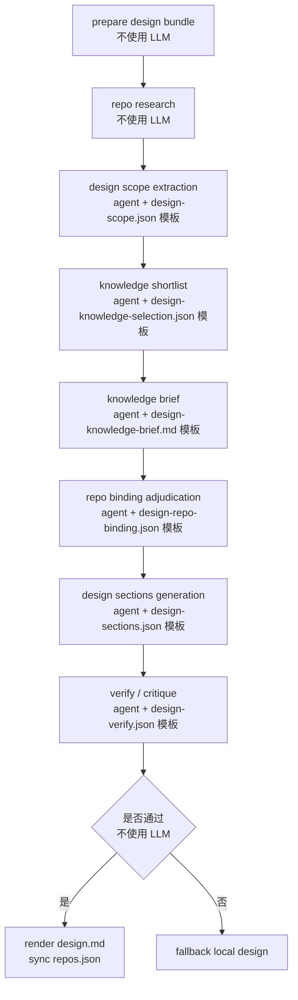

# Design V2 Design

本文用于定义 `coco-flow` 下一版 `Design` 阶段的正式设计。

结论优先：

- `Design` 应从当前 `plan` 前半段正式拆出，成为 `Refine` 与 `Plan` 之间的独立阶段。
- `Design` 的正式输入基线是 `prd-refined.md`，不是 `prd.source.md`；`Refine` 产物提供结构化提示，repo 本地 context 提供技术落点。
- `repos.json` 在 `Input` 阶段只表示“用户绑定的候选 repo”，真正的“哪些 repo 本次要做、各自承担什么职责、依赖关系是什么”，应在 `Design` 阶段定稿。
- `native Design` 应继续复用 `Refine` 的模式：controller 建模板文件，agent 直接填结构化产物；不采用 prompt-only JSON 作为主链路。
- `Plan` 在拆分后不再负责主责任 repo 判断和设计章节生成，只负责把 `Design` 的结论转成执行计划。

## 目标

`Refine` 解决的是“需求说清楚没有”，`Plan` 解决的是“接下来怎么执行”，`Design` 夹在中间，解决的是另外 4 件事：

1. 把面向产品的 refined 需求收敛成面向研发的设计结论。
2. 正式确认本次任务涉及哪些 repo、每个 repo 的职责边界是什么。
3. 把系统依赖、主链路、风险点和专项判断沉淀成稳定设计产物。
4. 给后续 `Plan` 和 `Code` 提供可稳定消费的结构化输入，而不是只给一份 Markdown。

换句话说，`Design` 回答的是：

- 为什么这样拆系统
- 哪些 repo 真的要动
- 每个 repo 为哪个改造点负责
- 主链路和专项风险应该怎么理解

而不是：

- 具体先改哪个目录
- 任务怎么排执行顺序
- `code` 阶段要怎么拆工作单

## 阶段定位

建议把 6 阶段工作流明确理解为：

1. `Input`：落原始输入与候选 repo。
2. `Refine`：收敛需求，不依赖 repo。
3. `Design`：第一次正式引入 repo 语义，输出系统设计与 repo 绑定。
4. `Plan`：基于设计结果拆执行任务与顺序。
5. `Code`：按 repo 执行实现。
6. `Archive`：归档。

职责边界建议固定为：

- `Refine`：回答“做什么”。
- `Design`：回答“为什么这么做、哪些系统和 repo 配合、边界在哪里”。
- `Plan`：回答“先做什么、后做什么、怎么验证最小闭环”。

迁移期兼容建议：

- CLI / API 可以暂时仍保留 `tasks plan` / `POST /plan` 入口。
- 但内部编排应升级成 `design -> plan` 两段。
- UI 已经可以继续展示 `Design` / `Plan` 两个节点，不必等接口名字变更。

## Design 输入契约

本版 `Design` 的输入，不再理解成“plan 的准备材料”，而是理解成 `Design Bundle`。

### 输入来源

`Design` 主链路只消费以下几类输入：

1. `prd-refined.md`
2. `refine-intent.json`
3. `refine-knowledge-read.md`
4. `input.json`
5. `repos.json`
6. repo 本地 context 与 repo research 结果
7. 设计阶段可用的 approved knowledge 文档

其中：

- `prd-refined.md` 是唯一的需求事实基线。
- `refine-intent.json` 和 `refine-knowledge-read.md` 是结构化辅助输入。
- `input.json` 只提供标题、补充说明和来源级上下文。
- `repos.json` 提供候选 repo 集合，但还不是最终设计结论。
- repo 本地 context 和 research 只用于技术落点判断，不能覆盖需求事实。

### 必需输入

`Design` 至少需要以下字段：

- 标题：优先取 `input.json.title`，其次取 `task.json.title`
- refined 正文：取 `prd-refined.md`
- repo 候选集合：取 `repos.json.repos[*].id/path`

推荐但非必须的输入：

- `input.json.supplement`
- `refine-intent.json`
- `refine-knowledge-read.md`
- `.livecoding/context/` 中的 glossary / architecture / patterns / gotchas

### 不应作为主判断基线的输入

以下输入可以留作 trace 或兜底，但不应成为主链路事实来源：

- `prd.source.md`
- `source.json`
- `Refine` 之前的原始 prompt / 原始输入碎片

如果 `prd-refined.md` 已存在，`Design` 不应回退成重新从 `prd.source.md` 理解需求。

### 输入读取原则

1. 需求边界只以 `prd-refined.md` 为准。
2. `refine-intent.json` 只能帮助提炼设计焦点，不能覆盖 refined 结论。
3. `refine-knowledge-read.md` 只能提供术语解释、稳定规则和冲突提醒，不能替代当前需求。
4. `repos.json` 在进入 `Design` 时只表示“候选 repo 集合”，不表示“这些 repo 已经全部确认要改”。
5. repo 本地 context 只用于技术 grounding，不用于定义业务事实。

### Design Bundle 视图

可以把 `Design` 的输入理解成这样：

```text
task/<task_id>/
├── prd-refined.md
├── refine-intent.json
├── refine-knowledge-read.md
├── input.json
├── repos.json
└── repo local context
    └── <repo>/.livecoding/context/*
```

## repo 绑定在 Design 的语义

这是本版设计里最需要明确的点。

### 三层语义要分开

建议把 repo 相关信息显式分成 3 层：

1. `Input attached repos`
2. `Design repo binding`
3. `Runtime repo state`

它们不是一回事。

### 1. `Input attached repos`

`Input` 阶段落到 `repos.json` 的内容，语义应该是：

- 用户显式绑定或默认附带的 repo 候选集合
- 后续 `Design` 允许读取和调研的 repo 范围
- 不是最终设计结论

也就是说，`Input` 只回答：

- 本任务允许从哪些 repo 里找答案

它不回答：

- 哪个 repo 是主责任仓库
- 哪个 repo 只是参考或联动
- 哪个 repo 最终不在本次范围内

### 2. `Design repo binding`

正式的 repo 绑定应该在 `Design` 阶段产出。

它需要回答每个候选 repo 的 6 个问题：

1. 这个 repo 是否属于本次改动范围。
2. 它是 `primary`、`supporting`、`reference`，还是 `out_of_scope`。
3. 它服务于哪些系统改造点。
4. 它本次承担什么职责。
5. 它的改动边界是什么。
6. 它依赖哪些上游 repo，或会阻塞哪些下游 repo。

建议引入独立 artifact：

- `design-repo-binding.json`

建议结构：

```json
{
  "repo_bindings": [
    {
      "repo_id": "live-pack",
      "repo_path": "/path/to/live-pack",
      "decision": "in_scope",
      "role": "primary",
      "serves_change_points": [1, 2],
      "system_name": "竞拍卡主链路",
      "responsibility": "承接主状态流转与前端展示收口",
      "change_summary": ["补齐状态判断", "对齐主链路字段消费"],
      "boundaries": ["仅处理竞拍讲解卡链路", "不扩展到其它卡型"],
      "candidate_dirs": ["web/src/cards/auction", "server/auction"],
      "candidate_files": ["web/src/cards/auction/index.tsx"],
      "depends_on": [],
      "parallelizable_with": [],
      "confidence": "high",
      "reason": "refined 范围与本地 research 都指向该 repo"
    }
  ],
  "missing_repos": [],
  "decision_summary": "一句话总结"
}
```

其中字段语义建议收敛为：

- `decision`
  - `in_scope`
  - `out_of_scope`
  - `uncertain`
  - `missing_input`
- `role`
  - `primary`
  - `supporting`
  - `reference`

### 3. `Runtime repo state`

`repos.json` 仍应继续保留，原因是：

- `code` 阶段要在这里写 `status / branch / worktree / commit`
- UI 和 lifecycle 逻辑已经大量依赖它

但它不应再是唯一的 repo 语义来源。

建议做法：

- `design-repo-binding.json` 作为设计阶段的正式、可追踪产物
- `repos.json` 作为运行时状态文件
- `Design` 结束时，把必要的绑定结果同步回 `repos.json`

建议同步的最小字段：

- `in_scope`
- `design_role`
- `depends_on`
- `candidate_dirs`
- `candidate_files`

### 前移后的硬约束

一旦 `Design` 完成，就应满足下面两条约束：

1. `Plan` 不再重新判断主责任 repo，只消费 `Design` 的 repo binding 结果。
2. `Code` 不允许偷偷把 `Design` 明确排除的 repo 又拉回主链路。

如果后续需要重新加 repo，应该显式重跑 `Design`，而不是让 `Plan` 或 `Code` 静默扩 scope。

## Design 输出契约

`Design` 的输出应该分成两类：

1. 面向人阅读的 `design.md`
2. 面向程序消费的结构化 artifacts

### 正式输出文档

仍然使用：

- `design.md`

章节结构继续沿用当前已经基本收敛的 7 章：

1. `系统改造点`
2. `方案设计`
3. `多端协议是否有变更`
4. `存储&&配置是否有变更`
5. `是否有实验，实验怎么涉及`
6. `给 QA 的输入`
7. `人力评估`

约束：

- `design.md` 只表达设计，不表达任务拆分。
- `design.md` 可以提 repo 职责和依赖，但不应直接展开成 `T1 / T2 / T3`。
- `design.md` 可以出现 candidate files 作为证据，但不能退化成文件清单。

### 结构化产物

建议 `Design` 至少生成下面这些 artifact：

1. `design-research.json`
2. `design-scope.json`
3. `design-knowledge-selection.json`
4. `design-knowledge-brief.md`
5. `design-repo-binding.json`
6. `design-sections.json`
7. `design-verify.json`
8. `design-result.json`

建议职责如下：

- `design-research.json`
  - 记录每个 repo 的本地 research 结果
  - 包括 glossary hits、unmatched terms、candidate dirs/files、notes、context availability
- `design-scope.json`
  - 记录设计阶段的范围收敛结果
  - 只回答范围、系统焦点、repo 焦点、风险焦点、验证焦点
- `design-knowledge-selection.json`
  - 记录 design 阶段选了哪些知识文档、为什么选
- `design-knowledge-brief.md`
  - 只沉淀能服务设计判断的信息
  - 例如稳定规则、系统边界、验证重点、协议约束
- `design-repo-binding.json`
  - 作为 repo 绑定的正式契约
- `design-sections.json`
  - 作为 `design.md` 背后的正式结构对象
- `design-verify.json`
  - 记录 verifier 对设计结构完整性和 repo 绑定一致性的校验结果
- `design-result.json`
  - 记录本轮设计阶段的摘要、模式、状态和关键 artifact 列表

### `design-sections.json` 的语义

`design.md` 不应是后续 `Plan` 反向解析的唯一来源。

建议让 `design-sections.json` 成为真正的机器契约，它至少应覆盖：

```python
DesignSections(
    system_change_points=[],
    solution_overview="",
    system_changes=[],
    system_dependencies=[],
    critical_flows=[],
    protocol_changes=[],
    storage_config_changes=[],
    experiment_changes=[],
    qa_inputs=[],
    staffing_estimate=None,
)
```

也就是说：

- `design.md` 是给人看的渲染结果
- `design-sections.json` 是给 `Plan` 和后续流程吃的正式输入

`Plan` 不应在 `design-sections.json` 已存在时，再去从 Markdown 中猜字段。

### 输出落盘原则

建议采用下面的落盘顺序：

1. 先写结构化 artifact
2. 再本地 render `design.md`
3. 最后同步 `repos.json` 和 task status

不要让 agent 直接生成最终 `design.md` 后，再让程序反向猜结构。

## Design 阶段的知识与 repo context

这也是 `Design` 和 `Refine` 的关键不同点。

### `Refine` 的知识来源

- 只看知识库文档
- 不看 repo

### `Design` 的知识来源

`Design` 应同时消费两类上下文：

1. 设计知识文档
2. repo 本地 context / research

两者分工不同：

- 设计知识文档：解释稳定规则、系统边界、协议约束、验证重点
- repo 本地 context：解释真实代码落点、术语映射、目录范围和实现习惯

### 设计知识的筛选条件

正式状态建议是：

1. `status=approved`
2. `engines` 包含 `design`

迁移兼容期可以允许：

- 若没有 `engines=design` 的文档，则临时回退到 `engines` 包含 `plan` 的文档

但这个兼容应只作为过渡，不应长期把 `design` 和 `plan` 混成一个知识入口。

### repo research 的角色

repo research 在 `Design` 阶段是正式输入，不再只是 `plan` 的内部准备步骤。

它应至少产出：

- glossary hits
- unmatched terms
- candidate dirs
- candidate files
- repo notes
- context availability

这些结果应持久化进 `design-research.json`，而不是只写进 `plan.log`。

## 是否也采用 agent 模板化产物生成

结论：是。

而且应该显式沿用 `Refine` 的模式，不走 prompt-only JSON 优先路线。

### 为什么不是 prompt-only JSON

如果继续采用“发一个 prompt，让模型直接吐 JSON 文本”的方式，至少有 4 个问题：

1. repo binding、design sections、verify 这些结果很难做文件级 trace。
2. 大对象 JSON 容易被模型输出解释性文字污染，parser 很脆。
3. 难以做“模板未填完”的守门。
4. 人工补救时，不容易直接在 task 目录下查看和修改中间产物。

### 建议复用的模式

推荐完全沿用 `Refine` 的组织方式：

1. controller 先在 task 目录创建固定模板文件。
2. agent 只负责直接编辑模板文件。
3. controller 再读取文件、检查占位符、做 schema 校验。
4. 校验通过后再 render 正式 Markdown。

建议模板化的 artifact：

- `design-scope.json`
- `design-knowledge-selection.json`
- `design-knowledge-brief.md`
- `design-repo-binding.json`
- `design-sections.json`
- `design-verify.json`

可以注意一点：

- 这里不是反对 JSON artifact
- 反对的是“prompt-only 直接回 JSON 文本”成为默认主链路

也就是说，本版 `Design` 仍然会大量使用 JSON，但方式应该是：

- controller 建 JSON 模板
- agent 填 JSON 文件
- controller 校验 JSON 文件

而不是：

- prompt 要求模型直接在 stdout 返回一个大 JSON

## Design 引擎编排逻辑

本版 `Design` 也建议采用多步小任务，不用单个超大 Prompt。

### 流程概览



### 各步骤职责

#### 1. `prepare design bundle`

不需要 LLM。

负责：

- 读取 `prd-refined.md`
- 读取 `refine-intent.json`
- 读取 `refine-knowledge-read.md`
- 读取 `input.json`
- 读取 `repos.json`
- 做基本空值检查

#### 2. `repo research`

不需要 LLM。

负责：

- 对每个候选 repo 读取 `.livecoding/context`
- 提取 glossary 命中
- 搜索 candidate dirs / files
- 形成 per-repo research snapshot

artifact：

- `design-research.json`

#### 3. `design scope extraction`

需要 LLM。

目标：

- 把 refined 需求压成设计阶段的范围基线
- 提炼系统焦点、repo 焦点、风险焦点和验证焦点

建议输出结构：

- `summary`
- `boundaries`
- `system_focus`
- `repo_focus`
- `risk_focus`
- `validation_focus`

artifact：

- `design-scope.json`

#### 4. `knowledge shortlist`

需要 LLM。

目标：

- 基于 `Design Scope` 和 repo research，从 approved knowledge 中选出少量与设计决策最相关的文档

artifact：

- `design-knowledge-selection.json`

#### 5. `knowledge brief`

需要 LLM。

目标：

- 深读已选知识
- 提取只服务设计判断的内容

建议输出重点：

- 系统边界
- 稳定规则
- 协议 / 配置 / 实验相关约束
- 验证要点

artifact：

- `design-knowledge-brief.md`

#### 6. `repo binding adjudication`

需要 LLM。

目标：

- 基于 refined 需求、repo research 和 knowledge brief，正式判断 repo binding

artifact：

- `design-repo-binding.json`

这一步是本版新增的核心，不应再放到 `Plan` 阶段顺带完成。

#### 7. `design sections generation`

需要 LLM。

目标：

- 生成 `DesignSections` 结构对象
- 不直接输出最终 Markdown

artifact：

- `design-sections.json`

#### 8. `verify / critique`

需要 LLM。

重点检查：

1. repo binding 是否和设计章节一致
2. 是否明确回答系统职责和依赖关系
3. 是否覆盖协议 / 配置 / 实验 / QA 等专项判断
4. 是否明显脱离本地 research 的证据范围

artifact：

- `design-verify.json`

#### 9. `render design.md`

不需要 LLM。

负责：

- 用 renderer 把 `design-sections.json` 和 `design-repo-binding.json` 渲染成正式 `design.md`
- 将必要绑定字段同步回 `repos.json`

## 哪些环节需要 LLM，哪些不需要

### 不需要 LLM

- 读取 refined / input / repos artifact
- 读取 repo 本地 context
- glossary 命中
- candidate files / dirs 搜索
- research 结果落盘
- render `design.md`
- 同步 `repos.json`

### 需要 LLM

- `design-scope.json` 模板填充
- `design-knowledge-selection.json` 模板填充
- `design-knowledge-brief.md` 模板填充
- `design-repo-binding.json` 模板填充
- `design-sections.json` 模板填充
- `design-verify.json` 模板填充

## 降级逻辑

`Design` 也建议沿用 `Refine` 的单次守门 + local fallback 思路，不做长链自循环重写。

### 无知识命中

允许继续。

行为：

- 不报错
- `design-knowledge-selection.json` 返回空结果
- 继续依赖 repo research 和 refined 输入生成 design

### 部分 repo 没有 context

允许继续，但要显式标记：

- `context_available=false`
- 在 `design-research.json` 或 `design-repo-binding.json` 中写明 grounding 不完整

### repo binding 无法确认

不应静默放过。

建议行为：

- 在 `design-repo-binding.json` 中把对应 repo 标成 `uncertain` 或 `missing_input`
- `design.md` 中显式指出需要补充的 repo 信息
- `Plan` 默认阻塞，不继续把不确定绑定转成执行任务

### LLM 某一步失败

允许局部或整体降级：

- `scope` 失败：本地规则提炼最小 scope
- `knowledge` 失败：降级为无知识模式
- `repo binding` 失败：本地规则给出低置信度 binding，并显式标记
- `verify` 失败：直接回退到 local design，不再做 rewrite loop

## 与当前实现的主要差异

对照当前 `plan` 实现，下一版 `Design` 至少要把下面这些内容从 `plan` 中拆出来：

1. `prepare_plan_build()` 中与设计相关的输入组装，拆到 `prepare_design_build()`
2. `build_repo_researches()` 与 `build_design_research_signals()` 正式归属到 `Design`
3. 当前 `plan-scope.json` 的范围收敛，迁移为 `design-scope.json`
4. 当前 design prompt 的 marker 文本输出，升级为 `design-sections.json` 模板化产物
5. 当前由 `plan` 隐式完成的 repo 责任判断，升级为 `design-repo-binding.json`

拆分后的 `Plan` 建议只保留：

- execution strategy
- task specs
- execution order
- verification plan
- blockers and risks

也就是：

- `Design` 负责“设计判断 + repo 绑定”
- `Plan` 负责“执行拆分 + 顺序编排”

## 当前结论

本版 `Design` 的核心变化，不是“把当前 design.md 另起一个文件名”，而是：

1. 把 `Design` 从 `Plan` 前半段正式拆成独立阶段。
2. 把 repo 绑定的正式语义前移到 `Design`。
3. 把 `design.md` 背后的结构对象沉淀成正式 artifact。
4. 沿用 `Refine` 的 controller 建模板 + agent 填文件模式，避免继续走 prompt-only JSON 主链路。

如果继续推进实现，建议顺序是：

1. 先落 `design-repo-binding.json` 和 `design-sections.json` 的正式 schema。
2. 再把当前 `plan` 的 repo research 与 design generation 迁到 `Design`。
3. 最后收窄 `Plan`，让它只消费 `Design` 结果生成执行计划。

## 新 Session 启动语

可以直接带下面这句话：

> 当前 Input 和 Refine 已经完成重构，Refine 采用 controller 建模板 + agent 填结构化产物的模式。现在继续设计 Design 阶段，要求尽量复用这套模式，不走 prompt-only JSON 优先路线，并把 repo 绑定正式前移到 Design。
