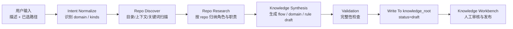
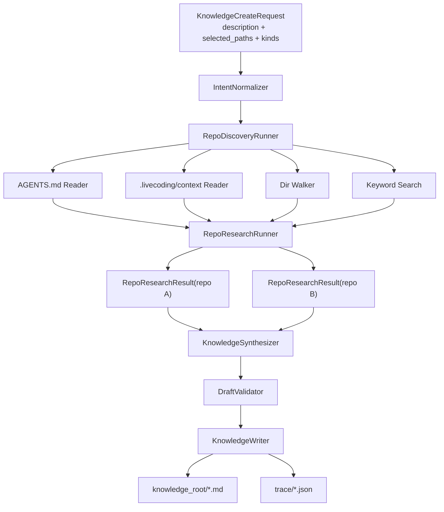
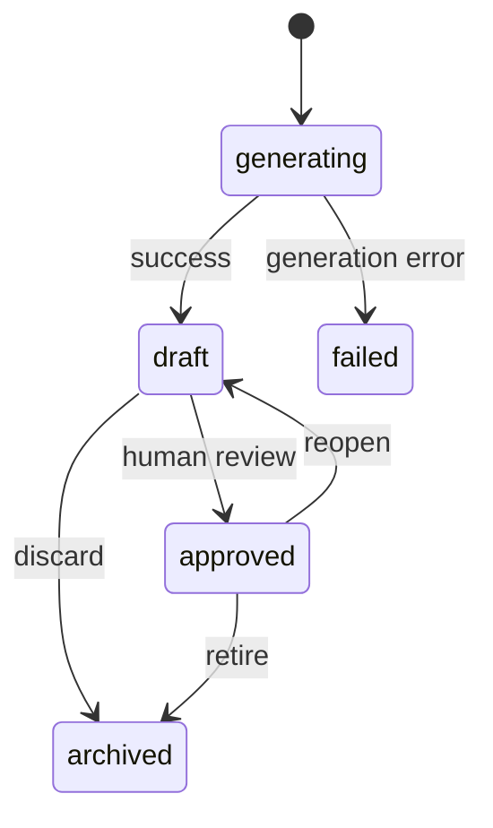

# Knowledge Generation Engine

本文描述 `coco-flow` 下一阶段的知识生成引擎设计。

目标不是“让模型自由生成知识库”，而是把知识生成变成一个受控的、多阶段的、可审阅的流程。

核心原则：

- LLM 只负责推断和起草
- 流程、状态、产物结构由程序控制
- 生成结果默认是 `draft`
- 默认不自动进入 `approved`
- `flow` 是第一优先产物
- `domain / rule` 作为补充产物

## 目标

知识生成引擎第一版要解决 4 件事：

1. 根据用户描述和已选路径，识别目标业务方向
2. 对多个 repo 做轻量调研，理解每个 repo 在系统链路中的角色
3. 生成结构化知识草稿
4. 把草稿和中间产物落盘，供 UI 审核和后续排查

非目标：

- 不做全自动知识发布
- 不追求一次生成完整知识体系
- 不在第一版里做复杂评分类或 judge/retry 编排
- 不把 repo 级 candidate file 结果直接固化成长期知识

## 一句话定位

这个引擎不是“知识库写手”，而是：

- 一个把“描述 + 路径”转成 `domain / flow / rule draft` 的受控工作流

## 第一版产物范围

建议第一版优先生成：

1. `flow`
2. 必要时补 `domain`
3. 如规则足够稳定，再补 `rule`

默认顺序：

- `flow` 必做
- `domain` 缺失时补
- `rule` 有明显默认规则时补

## 总体架构图



## 分阶段设计

### Stage 1: Intent Normalize

输入：

- 用户描述
- 用户勾选的生成类型
- 已选路径

输出：

- `domain_candidate`
- `requested_kinds`
- `normalized_intent`

这一步的目标是先把用户的自然语言目标收敛。

例如：

- 输入：`竞拍讲解卡表达层`
- 输出：
  - `domain_candidate = auction_explain_card`
  - `requested_kinds = [flow]`
  - `normalized_intent = 竞拍讲解卡表达层系统链路`

这一层应尽量规则优先，不要让模型过度自由发挥。

### Stage 2: Repo Discover

输入：

- `normalized_intent`
- 已选路径列表

动作：

- 判断每个路径是否为 git repo
- 读取 repo 下 `AGENTS.md`
- 读取 repo 下 `.livecoding/context/`，如果存在
- 读取目录结构
- 基于意图关键词跑轻量搜索

输出：

- `repo-discovery.json`

每个 repo 产出最少包含：

- `repo_id`
- `repo_path`
- `agents_present`
- `context_present`
- `candidate_dirs`
- `candidate_files`
- `matched_keywords`

这一步先做“发现”，不急着做最终判断。

### Stage 3: Repo Research

输入：

- `normalized_intent`
- 每个 repo 的 discovery 结果

动作：

- 让 LLM 针对单个 repo 做受控归纳
- 只允许输出结构化结果，不允许自由散文

输出：

- `repo-research/<repo>.json`

每个 repo 最少产出：

- 这个 repo 在该需求中的角色
- 可能负责的模块
- 关键风险
- 明确事实
- 推断内容
- 待确认问题

这是整个引擎里第一次真正让 LLM 深度参与。

关键点：

- 按 repo 拆开研究
- 先理解“repo 角色”，不是先猜具体文件

### Stage 4: Knowledge Synthesis

输入：

- `normalized_intent`
- 所有 repo research 结果

动作：

- 汇总多 repo 研究结果
- 生成标准化知识草稿

输出：

- `knowledge-draft.json`
- Markdown 草稿文件

第一版只生成三类文档：

- `业务方向概览`
- `系统链路`
- `业务规则`

其中：

- `系统链路` 是第一优先
- `业务方向概览` 在 domain 不存在时补
- `业务规则` 在规则信号足够明确时补

### Stage 5: Validation

输入：

- draft 文档

动作：

- 检查标题是否符合约束
- 检查 kind 是否符合约束
- 检查正文是否为空
- 检查 `flow` 是否有 `Repo Hints`
- 检查是否保留 `Open Questions`

输出：

- `validation-result.json`

这一步先做静态完整性检查，不做复杂 LLM judge。

### Stage 6: Persist

输入：

- 通过校验的 draft

动作：

- 落盘到 `knowledge_root`
- 状态固定为 `draft`
- 保留中间 trace 文件

输出：

- `domains/*.md`
- `flows/*.md`
- `rules/*.md`
- 若需要，可额外保留 trace 目录

## 细化架构图



## 输入输出契约

### 输入契约

建议有一个统一请求：

```json
{
  "description": "竞拍讲解卡表达层",
  "selected_paths": [
    "/Users/bytedance/go/src/demo",
    "/Users/bytedance/go/src/test"
  ],
  "kinds": ["flow"],
  "notes": "先关注表达层入口和渲染链路"
}
```

### 输出契约

建议统一返回：

```json
{
  "documents": [
    {
      "kind": "flow",
      "title": "系统链路",
      "status": "draft"
    }
  ],
  "trace_id": "knowledge-20260415-xxxx",
  "open_questions": [
    "是否还有上游网关参与分流"
  ]
}
```

## 中间产物建议

建议把中间产物也落盘，至少包含：

- `intent.json`
- `repo-discovery.json`
- `repo-research/<repo>.json`
- `knowledge-draft.json`
- `validation-result.json`

原因很简单：

- 方便排查“为什么会生成成这样”
- 方便后续做调试 UI
- 方便 future judge/retry 演进

第一版即使不在 UI 里暴露，也值得保留。

## 为什么不直接生成代码映射

当前不建议把“代码映射”做成独立的长期知识对象。

原因：

- 代码结构变化太快
- 长期维护成本高
- 容易误导 `plan`

更合适的做法是：

- `flow` 中保留轻量 `Repo Hints`
- `plan` 运行时再按 repo 分发探索
- 每个 repo 再结合自己的 `AGENTS.md`、`.livecoding/context` 和代码搜索继续收敛

所以引擎生成的是：

- 系统级知识

不是：

- 长期精确代码地图

## 第一版状态流



关键原则：

- 引擎只能把知识生成到 `draft`
- `approved` 必须来自人工确认

## LLM 参与边界

建议明确三层边界：

### 程序控制

- 路径校验
- repo 枚举
- 文件读取
- 搜索
- 状态流转
- 落盘
- 校验

### LLM 参与

- repo 角色归纳
- 跨 repo 链路综合
- draft 起草
- 待确认问题归纳

### 不交给 LLM 的东西

- 最终状态决定
- 文件路径选择权的唯一来源
- 自动发布
- 直接替代人工审核

## 第一版实现建议

我建议实现顺序如下：

1. `IntentNormalizer`
2. `RepoDiscoveryRunner`
3. `RepoResearchRunner`
4. `FlowDraftSynthesizer`
5. `DraftValidator`
6. `KnowledgeWriter`

实现切口建议：

- 第一版先只做 `flow`
- `domain / rule` 先做可选补充
- 先不做复杂 retry
- 先不做 judge model

## 与 UI 的关系

UI 侧的 `Knowledge Workbench` 只负责：

- 发起生成请求
- 查看生成结果
- 编辑文档
- 状态切换

引擎负责：

- 生成草稿
- 生成 trace
- 落盘

两者分工要保持清晰。

## 下一步建议

文档明确后，建议实现顺序是：

1. 增加 `knowledge generation` 的内部 service 模块
2. 先接一个最小命令或 API
3. 跑通单次 `flow draft` 生成
4. 把 trace 文件写出来
5. 再把 UI 接到真实生成接口

第一版最小成功标准：

- 输入一句描述
- 选几个路径
- 生成一份 `系统链路` draft
- 落盘到 `knowledge_root`
- UI 能读到并继续编辑
