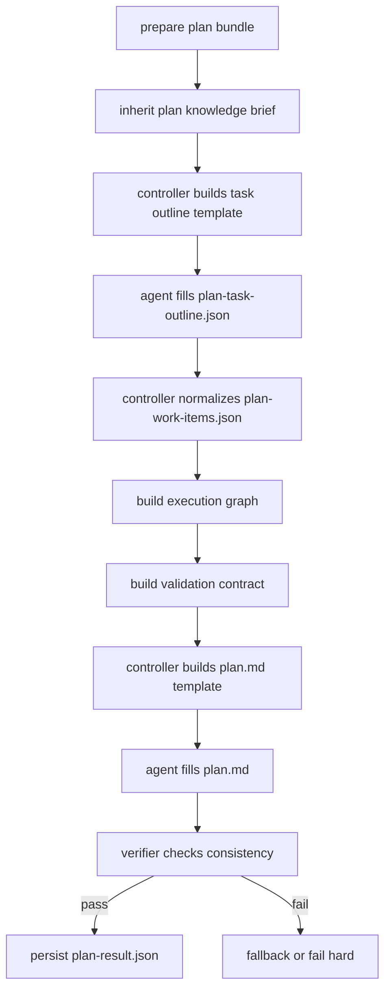

# Plan V2 Design

本文定义 `coco-flow` 下一版正式 `Plan` 阶段。

本文默认建立在以下前提上：

- `Input` 已完成独立重构
- `Refine` 已完成独立重构
- `Design` 已完成独立重构
- `Plan` 需要接在 `Design` 之后，正式消费 `Design` 结构化产物

如果本文与代码不一致，以代码为准；如果后续按本文实施，落地时应同步清理旧 `plan` 设计文档和旧实现中的过时假设。

## Executive Summary

- `Plan` 是独立于 `Design` 的执行编排阶段，不再兼容当前旧 `plan` 逻辑。
- `Plan` 的唯一上游基线是 `Design Bundle`，而不是 `prd-refined.md + repo research` 的旧混合输入。
- `Plan` 不再负责 repo discovery、repo exploration、repo binding adjudication、system design conclusion，这些职责全部留在 `Design`。
- `Plan` 只负责把已经确认的设计结论转成可执行的任务图、执行顺序、并发关系、验证计划和交付边界。
- `Plan` 也应采用 `controller 建模板 + agent 填结构化产物 + verifier 校验 + markdown 派生` 的模式。
- `plan.md` 不再是唯一真相源；机器可读 artifact 才是下游 `Code` 的正式输入。

## Goals

`Plan` 需要回答的问题是：

1. 在已经完成 `Design` adjudication 后，应该实际执行哪些工作项？
2. 这些工作项按什么顺序推进，哪些可以并发，哪些必须串行？
3. 每个工作项的目标、边界、输入、产出和 done definition 是什么？
4. 每个工作项应该如何验证，最小验证链路是什么？
5. `Code` 阶段应该按什么 repo / task 切面消费这些结果？

一句话：

- `Refine`: 这件事到底要做什么
- `Design`: 为什么是这些系统 / repo / 边界
- `Plan`: 先做什么、后做什么、如何验证完成

## Non-Goals

`Plan` 不应该：

- 重新做 repo discovery
- 重新判定 repo 是否 in scope
- 重新生成 `Design` 级系统结论
- 把需求扩写成新的产品描述
- 直接产出代码 diff 或 commit 方案
- 为兼容旧 `plan.py` 继续保留扁平混合结构
- 把 `design.md` 当作唯一输入而忽略结构化 artifact

## Why Old Plan Must Be Replaced

当前旧 `plan` 逻辑存在几个根本问题：

1. `Plan` 和 `Design` 职责缠绕
   - 旧实现里 `plan` 仍在做 system change / dependency / candidate repo 级推断
   - 这与 `Design` 的正式职责冲突

2. 输入基线不对
   - 旧实现主要从 `prd-refined.md`、repo research、本地 heuristics 出发
   - `Design` 已经形成正式 adjudication 之后，`Plan` 不应继续绕开这些结论

3. 输出契约不稳定
   - 旧 `plan.md` 更像渲染后的文档，而不是独立稳定的执行 source of truth
   - `Code` 难以稳定消费

4. 目录结构不对
   - 当前 `plan.py / plan_generate.py / plan_render.py / plan_models.py / plan_research.py` 仍是旧时代平铺结构
   - 与 `Refine` / `Design` 的 bundle 化、pipeline 化模式不一致

因此 `Plan V2` 的目标不是“在旧 plan 上继续叠逻辑”，而是直接定义新的阶段契约和新的 engine 结构。

## Stage Positioning

正式责任切分应当是：

1. `Input`
   - 落原始输入、补充材料、附带 repo hint

2. `Refine`
   - 澄清需求意图
   - 抽取术语、规则、约束、接受标准

3. `Design`
   - 做 repo discovery / exploration / binding adjudication
   - 做 system-level design conclusion
   - 输出正式设计边界

4. `Plan`
   - 基于 `Design` 结论生成可执行任务图
   - 明确顺序、并发关系、验证计划

5. `Code`
   - 按 repo / task 边界执行

6. `Archive`
   - 汇总和收口

短版定义：

- `Design` owns system truth
- `Plan` owns execution truth

## Design -> Plan Boundary

这是本阶段最重要的边界。

### `Design` 的终点

`Design` 结束时，系统必须已经明确：

- 哪些 repo 在 scope 内
- 哪些 repo 是 `primary` / `supporting` / `reference`
- 每个 repo 服务哪些 change points
- 每个 repo 的责任、边界、依赖关系
- 系统级 changes / dependencies / critical flows

这些问题在 `Plan` 里不能重新 adjudicate。

### `Plan` 的起点

`Plan` 的起点应该是：

- 设计边界已确定
- repo binding 已确定
- system change conclusion 已确定
- 验证重点已有 baseline

`Plan` 只需要继续回答：

- 把这些结论拆成哪些 work items
- 如何排序
- 如何并发
- 如何验证
- 如何给 `Code` 供给稳定输入

### 明确禁止的行为

`Plan` 禁止做以下事情：

- 因为本地 research 命中变化而把 `out_of_scope` repo 拉回 scope
- 覆盖 `Design` 的 `scope_tier`
- 重新定义 system responsibilities
- 以 `plan.md` 自由文本反向覆盖 `design-repo-binding.json`

如果 `Plan` 发现 `Design` artifact 明显自相矛盾，正确做法是：

- 在 `plan-verify.json` 中显式报错
- 将任务标记为 `failed`
- 要求返回 `Design` 修复

而不是在 `Plan` 阶段偷偷修正设计真相。

## Input Contract

`Plan` 消费的是 `Plan Bundle`，不是原始 task 历史，也不是旧 `PlanBuild`。

### Required Inputs

最小必需输入：

1. `design-repo-binding.json`
2. `design-sections.json`
3. `design.md`
4. `task title`

其中：

- `task title` 优先来自 `input.json.title`
- 若缺失则回退到 `task.json.title`

### Strongly Recommended Inputs

强推荐输入：

1. `plan-knowledge-brief.md` 或可重建该 brief 的知识选择结果
2. `prd-refined.md`
3. `refine-intent.json`
4. `refine-knowledge-selection.json`
5. `refine-knowledge-read.md`
6. `repos.json`

这些输入的角色是：

- `Design` artifacts 是正式基线
- `Refine` artifacts 是继承背景
- `repos.json` 是 runtime state，不是设计真相

### Inputs That Must Be Treated As Primary Truth

以下输入是 `Plan` 的 primary truth：

1. `design-repo-binding.json`
2. `design-sections.json`
3. `design-result.json`

如果这些文件存在，则 `Plan` 不应绕开它们直接回退到 `prd-refined.md` 做主判断。

### Inputs That Must Not Become The Main Baseline

以下内容可以作为 provenance 或补充背景，但不能成为 `Plan` 主基线：

- `prd.source.md`
- 原始 `input` 文本
- 旧 `plan.md`
- 旧 `plan-scope.json`
- 旧 `plan-execution.json`
- 本地 heuristics 推出来的 repo 责任猜测

## Plan Bundle

推荐的 `Plan Bundle` 应为：

```text
Plan Bundle
├── title
├── design_markdown
├── design_repo_binding_payload
├── design_sections_payload
├── design_result_payload
├── repos_runtime_payload
├── refined_markdown
├── refine_intent_payload
├── refine_knowledge_brief_markdown
└── task metadata
```

controller 先把这些输入读入并归一化，再进入后续 LLM / non-LLM 步骤。

## Plan Responsibility Model

`Plan` 的核心是把 `Design` 结论转成三层 execution truth：

1. execution units
2. execution graph
3. validation contract

### 1. Execution Units

每个 work item 需要回答：

- 属于哪个 repo 或跨 repo coordination unit
- 服务哪些 design change points
- 目标是什么
- 输入依赖是什么
- 产出是什么
- done definition 是什么

### 2. Execution Graph

`Plan` 需要把 work item 之间的关系明确成图，而不是只给一串有序列表。

最少要表达：

- `depends_on`
- `parallelizable_with`
- `blocked_by`
- `coordination_required_with`

### 3. Validation Contract

`Plan` 需要把验证变成结构化 contract，而不是散落在 prose 里。

每个任务至少要回答：

- 最小验证命令或最小验证动作
- 验证对象
- 风险重点
- 是否需要联动验证
- 完成后需要回归哪些非目标项

## Output Contract

`Plan` 输出两类 artifact。

### Machine-Readable Source-of-Truth Artifacts

这些是正式下游输入：

1. `plan-work-items.json`
2. `plan-execution-graph.json`
3. `plan-validation.json`
4. `plan-verify.json`
5. `plan-result.json`

推荐保留以下中间产物：

6. `plan-task-outline.json`
7. `plan-dependency-notes.json`
8. `plan-risk-check.json`
9. `plan-knowledge-brief.md`

### Human-Readable Output

人类可读产物仍然是：

- `plan.md`

但它必须是结构化 artifact 派生结果，而不是唯一真相源。

## Artifact Definitions

### `plan-task-outline.json`

这是 LLM 第一步产出的候选任务骨架，用于后续图构建和校验。

推荐结构：

```json
{
  "task_units": [
    {
      "id": "W1",
      "title": "在 repo_a 收敛主状态改动",
      "repo_id": "repo_a",
      "task_type": "implementation",
      "serves_change_points": [1],
      "goal": "完成主链路状态定义收敛",
      "scope_summary": [
        "仅覆盖主状态定义与入口适配"
      ],
      "inputs": ["design change point 1"],
      "outputs": ["repo_a 内主改动落地"],
      "done_definition": [
        "主链路逻辑落地",
        "与 design 责任保持一致"
      ],
      "validation_focus": [
        "最小编译通过",
        "关键链路 smoke"
      ],
      "risk_notes": [
        "避免把 supporting repo 误拉成主改仓"
      ]
    }
  ]
}
```

### `plan-work-items.json`

这是归一化后的正式 work items，供 `Code` 消费。

推荐字段：

- `id`
- `title`
- `repo_id`
- `role`
- `task_type`
- `serves_change_points`
- `goal`
- `change_scope`
- `inputs`
- `outputs`
- `done_definition`
- `verification_steps`
- `risk_notes`
- `handoff_notes`

### `plan-execution-graph.json`

这是正式执行图。

推荐字段：

- `nodes`
- `edges`
- `execution_order`
- `parallel_groups`
- `critical_path`
- `coordination_points`

`edges` 至少应有：

- `from`
- `to`
- `type`
- `reason`

其中 `type` 推荐支持：

- `hard_dependency`
- `soft_dependency`
- `parallel`
- `coordination`

### `plan-validation.json`

这是正式验证契约。

推荐结构：

```json
{
  "global_validation_focus": [
    "优先覆盖主链路和 design 指定的 critical flow"
  ],
  "task_validations": [
    {
      "task_id": "W1",
      "repo_id": "repo_a",
      "checks": [
        {
          "kind": "build",
          "target": "./path/...",
          "reason": "最小编译验证"
        }
      ],
      "linked_design_flows": ["主链路"],
      "non_goal_regressions": [
        "不应扩大到 reference repo"
      ]
    }
  ]
}
```

### `plan-verify.json`

这一步检查：

1. 每个 in-scope `must_change` repo 是否都被覆盖
2. supporting / validate-only repo 是否被误升级为主改任务
3. dependency graph 是否存在环或明显缺边
4. validation contract 是否覆盖了 design 的 critical flows 和 QA inputs
5. `plan.md` 是否与结构化 artifact 一致

### `plan-result.json`

这是阶段结果摘要。

推荐字段：

- `task_id`
- `status`
- `work_item_count`
- `repo_count`
- `critical_path_length`
- `parallel_group_count`
- `artifacts`
- `selected_knowledge_ids`

## `plan.md`

`plan.md` 应由 controller 生成 markdown 模板，再由 agent 按 structured artifact 填充。

推荐章节：

1. `实施策略`
2. `任务拆分`
3. `执行顺序`
4. `并发与协同`
5. `验证计划`
6. `阻塞项与风险`
7. `交付边界`

其中：

- `任务拆分` 对应 `plan-work-items.json`
- `执行顺序` / `并发与协同` 对应 `plan-execution-graph.json`
- `验证计划` 对应 `plan-validation.json`

## Engine Architecture

`Plan V2` 应模仿 `Refine` / `Design` 的目录拆分，不继续沿用平铺模块。

推荐结构：

```text
src/coco_flow/engines/plan/
├── __init__.py
├── source.py
├── knowledge.py
├── task_outline.py
├── graph.py
├── validation.py
├── generate.py
├── verify.py
├── models.py
├── logging.py
└── pipeline.py

src/coco_flow/prompts/plan/
├── __init__.py
├── shared.py
├── task_outline.py
├── graph.py
├── validation.py
├── generate.py
└── verify.py
```

## Responsibilities By Module

### `source.py`

负责：

- 读取 `Plan Bundle`
- 校验 `Design` artifact 是否齐全
- 构建 `PlanPreparedInput`
- 归一化 repo runtime 信息

不负责：

- 做新的 repo discovery
- 做 execution task 生成

### `knowledge.py`

负责：

- 继承 / 压缩 `Plan` 所需 knowledge brief
- 把 `Refine` 继承知识重新压成 execution-facing 内容

建议压成：

- 执行边界
- 稳定规则
- 验证要点
- 不可跨越约束

### `task_outline.py`

负责：

- 基于 `Design` artifacts 生成任务骨架模板
- agent 填写 `plan-task-outline.json`
- controller 做归一化

这一步是 `Plan` 的主生成步骤。

### `graph.py`

负责：

- 根据 work items 构造 execution graph
- 必要时让 agent 只补充 dependency / parallel hints
- 归一化成 `plan-execution-graph.json`

### `validation.py`

负责：

- 生成全局与任务级验证契约
- 产出 `plan-validation.json`

### `generate.py`

负责：

- 生成 `plan.md`
- 走固定模板 + agent 填写
- deterministic renderer 仅作为 fallback

### `verify.py`

负责：

- 校验结构化 artifact 的内部一致性
- 校验 `plan.md` 与结构化 artifact 一致
- 产出 `plan-verify.json`

### `pipeline.py`

负责整条主编排：

1. prepare input bundle
2. inherit knowledge brief
3. build task outline
4. normalize work items
5. build execution graph
6. build validation contract
7. generate `plan.md`
8. verify
9. persist result

## Orchestration Flow



## LLM vs Non-LLM Split

### Must Be Non-LLM / Controller-Owned

- input bundle preparation
- required artifact existence checks
- work item id allocation
- graph normalization
- cycle detection
- task-to-repo consistency checks
- artifact persistence

### Should Be LLM-Assisted

- task outline drafting
- dependency explanation refinement
- validation focus summarization
- final markdown filling
- verifier judgment

### Should Not Be LLM-Owned

- deciding whether `Design` truth should be overridden
- inventing new repo responsibilities
- inventing new in-scope repos
- changing runtime repo state

## Fast Paths

### Single Bound Repo Fast Path

如果 `Design` 最终只留下一个 `must_change` repo，`Plan` 允许 fast path：

- work item 数量可以更少
- graph 可以更简单
- verifier 可以降低 cross-repo 检查强度

但仍然必须产出完整结构化 artifact，而不是只写一份简化 `plan.md`。

### Multi Repo Path

如果有多个 in-scope repo：

- 必须显式给出 execution graph
- 必须显式给出 parallel groups
- 必须显式给出 coordination points

不能只靠 prose 表达“先改 A 再改 B”。

## Failure Semantics

如果 `Plan` 发现以下问题，应直接失败，而不是静默 fallback 成旧逻辑：

1. `Design` artifact 缺失
2. `Design` artifact 自相矛盾
3. `must_change` repo 未被任何 work item 覆盖
4. execution graph 存在明显环且无法归一化
5. validation contract 无法覆盖关键 design flows

允许 local fallback 的场景应仅限：

- native agent 未填模板
- verifier 输出不可解析
- markdown 生成失败但结构化 artifact 已经完整

也就是说：

- structure first
- markdown second

## Logging Contract

`plan.log` 建议升级为新的稳定字段：

- `plan_prepare_start / plan_prepare_ok`
- `plan_knowledge_start / plan_knowledge_ok`
- `plan_task_outline_start / plan_task_outline_ok`
- `plan_work_items_normalize_ok`
- `plan_graph_start / plan_graph_ok`
- `plan_validation_start / plan_validation_ok`
- `plan_generate_start / plan_generate_ok`
- `plan_verify_start / plan_verify_ok / plan_verify_failed`
- `status: planned`

不再继续沿用旧 `scope_start / execution_prompt_start` 这类偏旧流程命名。

## Data Model Suggestions

推荐核心 dataclass：

- `PlanPreparedInput`
- `PlanWorkItem`
- `PlanExecutionEdge`
- `PlanExecutionGraph`
- `PlanValidationCheck`
- `PlanEngineResult`

同时把旧 `plan_models.py` 中混杂的 `DesignAISections`、`ExecutionAISections`、`PlanBuild` 等模型视为待淘汰对象，而不是继续演进。

## Migration Strategy

`Plan V2` 的实施建议是直接并行新建目录，不在旧文件上增量打补丁：

1. 新建 `src/coco_flow/engines/plan/`
2. 新建 `src/coco_flow/prompts/plan/`
3. 在 workflow 壳接入新的 `run_plan_engine(...)`
4. 保留旧实现仅作为临时回退，不继续扩展
5. 新实现稳定后删除旧 `plan.py / plan_generate.py / plan_render.py / plan_models.py / plan_research.py`

这里的关键原则是：

- migrate forward
- do not dual-maintain two semantic versions of plan for long

## Open Questions

实施前还需要确认的点：

1. `Code` 阶段最终是消费 `plan-work-items.json` 还是继续 repo 级入口 + task 级细分混合模式
2. `Plan` 是否需要额外产出 repo 级 `code-handoff.json`
3. `Design` 的 `validate_only` repo 在 `Plan` 中是否一定生成独立 work item，还是可并入主任务验证 contract
4. 多 repo task 的 execution graph 是否需要带 phase 概念

## Bottom Line

`Plan V2` 的本质不是“把 design.md 再加工成 plan.md”。

它是把 `Design` 已经确认的系统真相，正式转换成执行真相：

- work items
- dependency graph
- validation contract
- human-readable plan

只有这样，`Plan` 才能真正成为 `Design` 和 `Code` 之间稳定、可验证、可机器消费的桥梁。
