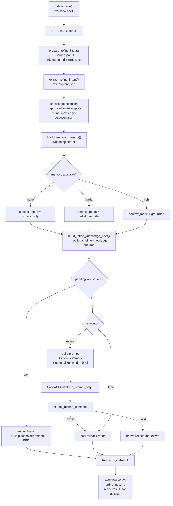

# Refine Engine

本文记录 `coco-flow` 当前 `refine` 引擎的实现状态，重点说明：

- 代码边界
- 实际运行编排
- 业务记忆接入与降级模式
- 产物与日志
- 当前能力边界

如本文与代码不一致，以代码为准。

## 代码位置

- workflow 壳：[src/coco_flow/services/tasks/refine.py](/Users/bytedance/Work/tools/bytedance/coco-flow/src/coco_flow/services/tasks/refine.py)
- refine pipeline：[src/coco_flow/engines/refine/pipeline.py](/Users/bytedance/Work/tools/bytedance/coco-flow/src/coco_flow/engines/refine/pipeline.py)
- refine models：[src/coco_flow/engines/refine/models.py](/Users/bytedance/Work/tools/bytedance/coco-flow/src/coco_flow/engines/refine/models.py)
- refine source：[src/coco_flow/engines/refine/source.py](/Users/bytedance/Work/tools/bytedance/coco-flow/src/coco_flow/engines/refine/source.py)
- refine intent：[src/coco_flow/engines/refine/intent.py](/Users/bytedance/Work/tools/bytedance/coco-flow/src/coco_flow/engines/refine/intent.py)
- refine knowledge：[src/coco_flow/engines/refine/knowledge.py](/Users/bytedance/Work/tools/bytedance/coco-flow/src/coco_flow/engines/refine/knowledge.py)
- refine generate：[src/coco_flow/engines/refine/generate.py](/Users/bytedance/Work/tools/bytedance/coco-flow/src/coco_flow/engines/refine/generate.py)
- 业务记忆 provider：[src/coco_flow/engines/business_memory.py](/Users/bytedance/Work/tools/bytedance/coco-flow/src/coco_flow/engines/business_memory.py)

## 分层职责

### workflow 壳

`services/tasks/refine.py` 负责：

- 定位 task 目录
- 校验 task 状态是否允许 `refine`
- 管理 `refine.log`
- 调用 `run_refine_engine(...)`
- 写入 `prd-refined.md`
- 写入 `refine-result.json`
- 更新 `task.json`

### engine

`engines/refine/` 负责：

- 读取 source 信息并组装 `RefinePreparedInput`
- 抽取 `refine-intent.json`
- 对 `approved + engines=refine` 的知识草稿做规则筛选，生成 `refine-knowledge-selection.json`
- 基于业务记忆生成 `refine-knowledge-brief.md`
- 判定是否是 pending Lark 场景
- 选择 `native` 或 `local`
- 在 prompt 中注入意图骨架和知识 brief
- 返回结构化结果 `RefineEngineResult`

### business memory

`engines/business_memory.py` 负责：

- 从 repo 下 `.livecoding/context/` 读取业务上下文
- 输出统一的 `BusinessMemoryContext`
- 在没有上下文时显式降级为 `source_only`

## 当前架构图

## 运行编排

当前 `refine` 的实际执行顺序如下：

1. workflow 壳读取 `task.json`
2. 校验状态必须是 `initialized` 或 `refined`
3. engine 先加载业务记忆
4. engine 先读取 `source.json`、`prd.source.md`、`repos.json`，组装 `RefinePreparedInput`
5. engine 抽取 `refine-intent.json`
6. engine 对 `approved + engines=refine` 的知识草稿做规则筛选，生成 `refine-knowledge-selection.json`
7. engine 生成可选的 `refine-knowledge-brief.md`
8. 如果是飞书文档且正文缺失，走 pending 分支
9. 否则根据 `COCO_FLOW_REFINE_EXECUTOR` 选择 `native` 或 `local`
10. `native` 失败时自动降级到 `local`
11. workflow 壳写回 markdown / json artifact，并更新 task 状态

## 业务记忆模型

当前 provider 读取 repo 下：

- `.livecoding/context/glossary.md`
- `.livecoding/context/business-rules.md`
- `.livecoding/context/faq.md`
- `.livecoding/context/history-prds.md`
- `.livecoding/context/architecture.md`
- `.livecoding/context/patterns.md`
- `.livecoding/context/gotchas.md`

provider 会返回三种模式：

- `source_only`
  说明没有可用业务记忆，不能做 grounding
- `partial_grounded`
  说明有少量上下文，但不完整
- `grounded`
  说明已加载较丰富上下文，可用于语义校准

### 降级原则

当没有业务记忆时，引擎不会失败，而是显式降级为 `source_only`：

- 仍然可以生成 `prd-refined.md`
- 但会记录风险提示
- prompt 会要求模型不要脑补缺失业务规则
- `refine-result.json` 会明确写出当前模式

## 输出契约

engine 返回 `RefineEngineResult`，当前字段包括：

- `status`
- `refined_markdown`
- `context_mode`
- `business_memory_used`
- `business_memory_provider`
- `business_memory_documents`
- `risk_flags`

workflow 壳会把这些结果落成两个 artifact：

### `prd-refined.md`

面向后续 `plan` 和人工阅读的 Markdown 文档。

### `refine-result.json`

当前会记录：

- `task_id`
- `status`
- `context_mode`
- `business_memory_used`
- `business_memory_provider`
- `business_memory_documents`
- `risk_flags`
- `intermediate_artifacts`
- `updated_at`

### `refine-intent.json`

当前会记录：

- `goal`
- `key_terms`
- `potential_features`
- `constraints`
- `open_questions`
- `source_length`

### `refine-knowledge-selection.json`

当前会记录：

- `selected_ids`
- `selected_titles`
- `candidates`
  - `score`
  - `repo_match`
  - `path_match`
  - `keyword_hits`

### `refine-knowledge-brief.md`

在存在可用业务记忆或筛中的 approved knowledge 时生成，供 native/local refine 统一消费。

## 日志

`refine.log` 当前会记录：

- `=== REFINE START === / === REFINE END ===`
- `task_id / task_dir / executor`
- `context_mode`
- `business_memory_provider`
- `business_memory_used`
- `business_memory_documents`
- `business_memory_files`
- `business_memory_risk_flags`
- `intent_goal`
- `intent_key_terms`
- `intent_terms`
- `knowledge_candidates`
- `selected_knowledge_ids`
- `knowledge_brief_documents`
- `knowledge_brief_files`
- `source_type / source_path / source_url / source_doc_token`
- `source_length`
- `prompt_start / prompt_ok`
- `fallback_local_refine`
- `pending_refine`

## 当前实现特点

当前版本已经具备：

- workflow 壳与 engine 分离
- `prepare -> intent -> knowledge selection -> knowledge brief -> generate` 多步编排
- 业务记忆 provider 抽象
- approved knowledge 的规则筛选接入
- 无上下文时显式降级
- `native -> local` 自动回退
- 结构化结果落盘

但仍然属于第一版引擎，还没有：

- 多阶段 extractor / judge / repair loop
- evidence-level 溯源
- section 级 verifier
- 业务记忆召回排序与 relevance scoring
- `refine-trace.json`

## 当前能力判断

当前 `refine` 更接近：

- 一个带业务记忆降级能力的需求整理引擎

还不是：

- 一个多阶段、可评分、可修复的完整需求理解引擎

如果后续继续演进，建议下一步优先增加：

1. `refine-trace.json`
2. 结构化事实抽取中间层
3. verifier / judge 节点
4. 业务记忆 relevance ranking
5. source fact 与 context inference 的显式区分
