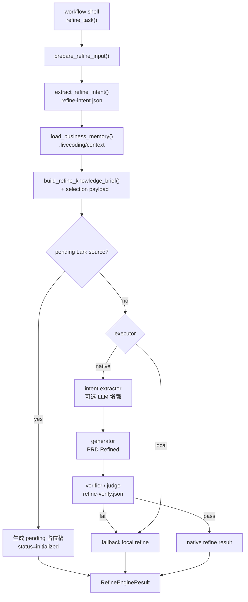

# Refine Engine

本文解释 `coco-flow` 当前 `refine` 引擎到底在做什么、为什么这么编排，以及这样设计的实际收益。

如果本文与代码不一致，以代码为准。

关于 `refine` 产物面向研发阅读的目标章节结构，另见
[`docs/refine-output-structure.md`](docs/refine-output-structure.md)。

## 先给结论

`refine` 的目标不是“把 PRD 润色一下”，而是把原始输入整理成一份后续 `plan` 可以稳定消费的、结构固定的 `prd-refined.md`。

它当前要解决的核心问题有三个：

- 原始 PRD 往往是散的，信息密度高但结构不稳定
- 需求里经常混有术语歧义、历史约束和缺失信息
- 直接一把梭生成 refined 文档，输出质量和稳定性都不够

所以当前实现把 `refine` 拆成了：

- `prepare`
- `intent`
- `knowledge selection`
- `knowledge brief`
- `generate`
- `verify`

这不是为了“显得复杂”，而是为了把不同类型的问题拆开处理：先收敛需求意图，再决定哪些历史知识真的该进场，最后才生成正文，并在生成后再做一次守门校验。

## 代码位置

- workflow 壳：[src/coco_flow/services/tasks/refine.py](/Users/bytedance/Work/tools/bytedance/coco-flow/src/coco_flow/services/tasks/refine.py)
- pipeline：[src/coco_flow/engines/refine/pipeline.py](/Users/bytedance/Work/tools/bytedance/coco-flow/src/coco_flow/engines/refine/pipeline.py)
- source 读取：[src/coco_flow/engines/refine/source.py](/Users/bytedance/Work/tools/bytedance/coco-flow/src/coco_flow/engines/refine/source.py)
- intent 抽取：[src/coco_flow/engines/refine/intent.py](/Users/bytedance/Work/tools/bytedance/coco-flow/src/coco_flow/engines/refine/intent.py)
- knowledge 选择与 brief：[src/coco_flow/engines/refine/knowledge.py](/Users/bytedance/Work/tools/bytedance/coco-flow/src/coco_flow/engines/refine/knowledge.py)
- generate / verify：[src/coco_flow/engines/refine/generate.py](/Users/bytedance/Work/tools/bytedance/coco-flow/src/coco_flow/engines/refine/generate.py)
- business memory provider：[src/coco_flow/engines/business_memory.py](/Users/bytedance/Work/tools/bytedance/coco-flow/src/coco_flow/engines/business_memory.py)

## 分层职责

### workflow 壳

`services/tasks/refine.py` 负责 workflow 层动作：

- 定位 task 目录
- 校验 task 状态是否允许执行 `refine`
- 维护 `refine.log`
- 调用 `run_refine_engine(...)`
- 落盘 `prd-refined.md` 和 `refine-result.json`
- 更新 `task.json`

这样做的好处是：task 生命周期和引擎推理解耦。以后即使要替换 `refine` 的内部实现，也不会把状态流转、日志和 artifact 写入逻辑搅在一起。

### engine

`engines/refine/` 只负责“如何把输入整理成 refined PRD”：

- 读取 source，组装 `RefinePreparedInput`
- 抽取需求意图骨架
- 选择可用业务知识
- 生成 knowledge brief
- 判定 pending Lark 分支
- 执行 `native` 或 `local`
- 对 `native` 结果做 verifier 守门
- 返回统一的 `RefineEngineResult`

这样做的好处是：`refine` 的输入、推理、回退和产物契约都集中在 engine 内，便于独立演进。

### business memory

`engines/business_memory.py` 负责从 repo 的 `.livecoding/context/` 中加载业务上下文。

它不直接生成 refined PRD，只提供 grounding 材料和风险信号。这样做的好处是：上下文来源可以替换，但 `refine` 的消费方式不需要跟着一起改。

## 为什么不是一个大 prompt

如果把原始 PRD、历史知识、context 和输出要求一次性全塞给模型，容易出现四类问题：

- 模型把历史知识当成当前需求事实
- 模型没有先收敛需求目标，导致输出结构化但不聚焦
- 模型把实现细节提前带入 `refine`
- 出错后很难知道是 source、knowledge 还是生成阶段出了问题

当前拆分后的思路是：

- `intent` 负责把“这次需求大概想干什么”先抽出来
- `knowledge brief` 负责把“哪些历史知识值得参考”压缩成小而明确的输入
- `generate` 负责正文生产
- `verify` 负责最后守门

收益是可诊断、可降级、可记录中间产物。

## 当前编排

## 每一步为什么存在

### 1. `prepare`: 先把输入统一成稳定结构

实现位置：[source.py](/Users/bytedance/Work/tools/bytedance/coco-flow/src/coco_flow/engines/refine/source.py)

这里会把 `source.json`、`prd.source.md`、`repos.json` 和 task 元信息合并成 `RefinePreparedInput`。

这么做的原因：

- 用户输入来源有三种：文本、本地文件、飞书文档
- 后续各阶段不应该知道输入来源差异
- pending Lark、repo root、source meta 都需要统一访问

收益：

- 下游 prompt 和本地兜底逻辑都只依赖一套输入模型
- 兼容不同 source 类型时，不需要在多个阶段重复写分支

### 2. `intent`: 先抽“意图骨架”，再生成正文

实现位置：[intent.py](/Users/bytedance/Work/tools/bytedance/coco-flow/src/coco_flow/engines/refine/intent.py)

当前会抽出：

- `goal`
- `key_terms`
- `potential_features`
- `constraints`
- `open_questions`

这么做的原因：

- 原始 PRD 往往混杂背景、举例、限制和未决问题
- 直接生成正文时，模型容易漏掉约束、混淆重点
- knowledge 选择也需要一个更稳定的“当前需求摘要”

收益：

- 让后续 generation 围绕当前需求目标收敛，而不是只看整篇原文自由发挥
- 把知识筛选从“全文模糊匹配”升级成“围绕目标和术语匹配”
- 即使 native 意图抽取失败，也有规则抽取的回退结果

### 3. `business memory + approved knowledge`: 先选知识，再注入

实现位置：

- [business_memory.py](/Users/bytedance/Work/tools/bytedance/coco-flow/src/coco_flow/engines/business_memory.py)
- [knowledge.py](/Users/bytedance/Work/tools/bytedance/coco-flow/src/coco_flow/engines/refine/knowledge.py)

这里有两类知识来源：

- repo 下 `.livecoding/context/` 的业务记忆
- 知识库里 `status=approved` 且 `engines` 包含 `refine` 的知识文档

这么做的原因：

- `refine` 需要术语消歧和历史约束，但不应该被实现细节主导
- 不是所有 approved knowledge 都适合当前需求
- 历史知识只能“辅助判断”，不能覆盖当前 PRD

因此当前设计不是把知识全文直接塞给模型，而是先做选择，再压成 brief。

收益：

- 减少 prompt 噪音和误导
- 降低“历史事实覆盖当前需求”的风险
- `native` 模式下还能再做一轮 LLM adjudication，进一步剔除不适合当前 refine 的知识

### 4. `knowledge brief`: 用摘要而不是原文注入

brief 会明确写出：

- 用途只限术语消歧、历史规则补充和冲突识别
- 当前 PRD 优先于历史知识
- 命中的 context / approved knowledge 摘要

这么做的原因：

- 模型更容易遵守“知识只作辅助，不作主输入”
- 历史文档通常冗长，直接注入性价比低
- 需要让 `native` 和 `local` 都能消费同一份中间结果

收益：

- 同一份 brief 既可用于 prompt，也可作为排障 artifact
- 本地 fallback 也能带着相同的上下文提示工作

### 5. pending Lark 分支：不要因为远端暂时取不到正文就把 task 打死

实现位置：[pipeline.py](/Users/bytedance/Work/tools/bytedance/coco-flow/src/coco_flow/engines/refine/pipeline.py)

如果 source 是飞书文档，但当前还取不到正文，就生成 pending 占位稿，并保持 `status=initialized`。

这么做的原因：

- 远端抓取失败不代表需求本身无效
- 用户经常需要先创建 task，再补正文

收益：

- task 创建链路更稳，不会因为外部依赖抖动而整体失败
- UI 和 CLI 都能给用户一个可恢复的中间状态

### 6. `generate`: native 负责质量，local 负责兜底

实现位置：[generate.py](/Users/bytedance/Work/tools/bytedance/coco-flow/src/coco_flow/engines/refine/generate.py)

当前有两条路径：

- `native`：调用 `coco` 生成结构化 `# PRD Refined`
- `local`：用规则抽取和模板输出兜底稿

这么做的原因：

- 需要 AI 的表达能力来整理复杂 PRD
- 但 workflow 不能把成败完全押在模型输出上

收益：

- 正常情况下拿到更高质量的 refined PRD
- native 失败时不会阻断主链路，至少仍有一个可编辑、可继续推进的结构化稿

### 7. `verify`: 生成后再守一次门

`native refine` 在生成正文后会再跑 verifier，检查：

- 是否以 `# PRD Refined` 开头
- 是否包含固定章节
- 缺失信息是否被放进“待确认问题”
- 是否引入了代码实现细节或脱离 PRD 的臆测

这么做的原因：

- 生成阶段追求“写出来”，验证阶段追求“写得对”
- 很多问题用单次生成 prompt 难彻底避免

收益：

- 把结构错误、越界推断和明显漏项拦在 `plan` 之前
- verifier 失败时自动回退到 `local`，比把坏稿直接落盘更稳

## 为什么要保留 `native -> local` 回退

这是当前 `refine` 最重要的工程设计之一。

原因很直接：

- `refine` 是后续 `plan` 的输入关口，不能因为模型失败而完全断流
- native 失败的原因很多，可能是 prompt 输出格式错误，也可能是 verifier 不通过
- 这些失败不一定意味着“无法继续”，只是意味着“不能信任这份 AI 结果”

因此当前策略是：

- 能用 native 就先用 native
- 只要 native 结果不可信，就立刻回到 local

好处不是“结果一定最好”，而是“流程一定能继续，并且失败是显式可见的”。

## 产物为什么这么多

当前 `refine` 会产出：

- `prd-refined.md`
- `refine-result.json`
- `refine-intent.json`
- `refine-knowledge-selection.json`
- `refine-knowledge-brief.md`
- `refine-verify.json`
- `refine.log`

这些产物不是为了留档而留档，而是分别服务三个目标：

- 给下游 `plan` 稳定输入：`prd-refined.md`
- 给系统恢复和 UI 展示用：`refine-result.json`
- 给排障和演进用：中间 json / md / log

这样做的好处是：你能明确看到问题出在意图抽取、知识筛选、生成还是验证，而不是只得到一个“refine 失败”。

## 当前收益

这套设计的实际收益主要是：

- 输出结构稳定，`plan` 更容易消费
- 历史知识被限制在“辅助角色”，不容易压过当前 PRD
- 失败时可降级、可恢复、可定位
- 中间产物足够多，便于后续继续优化 prompt、排序和 verifier

## 当前边界

当前 `refine` 仍然有明确边界：

- 它的目标是整理需求，不是做实现设计
- 它会消费业务记忆和 approved knowledge，但不会主动做 repo 级代码调研
- 它已经有 verifier，但还没有更细粒度的 section-level repair loop
- 它能发现缺失和冲突线索，但不能替代人工确认业务事实

如果继续往下演进，比较自然的方向是：

- 增加更细的 trace artifact
- 做 section 级修复而不是直接整体回退
- 提升 knowledge 召回和排序质量
- 显式区分“来自 source 的事实”和“来自历史知识的推断”
